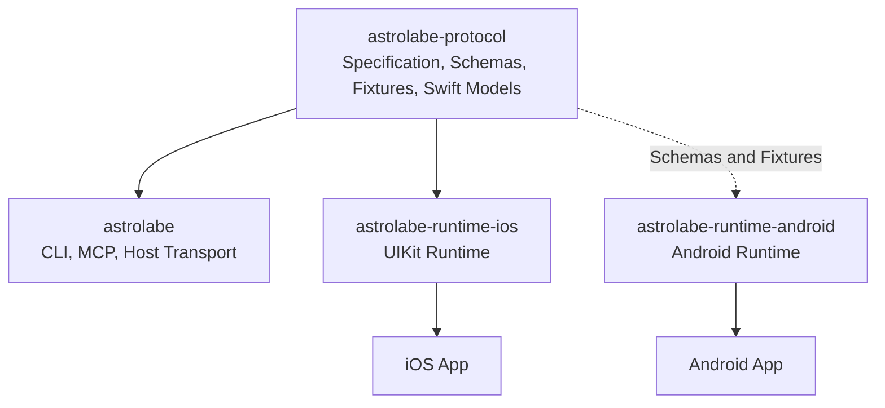

# Astrolabe Protocol Architecture

## 1. Decision

The independent `astrolabe-protocol` repository is the single source of truth
for communication between Astrolabe Host, the iOS Runtime, and the future
Android Runtime.

This design is implemented. The former `AstrolabeRuntimeProtocol` moved out of
`astrolabe-runtime-ios`, and Host no longer obtains protocol models through the
iOS Runtime. Both `astrolabe` and `astrolabe-runtime-ios` directly pin the
independent `AstrolabeProtocol 2.0.0` package.

After this separation, platform Runtime implementation changes no longer force
Host dependency updates. Host and platform Runtimes update the protocol package
only when the wire contract changes.

## 2. Target Architecture



Dependencies must remain unidirectional: Host and platform Runtimes depend on
the protocol, while the protocol depends on no platform, transport
implementation, or product-layer code.

## 3. Repository Responsibilities

| Repository | Responsibility | Excludes |
| --- | --- | --- |
| `astrolabe-protocol` | Wire protocol, DTOs, version negotiation, error models, Schemas, and Fixtures | UIKit, Android View, TCP listeners, usbmux, CLI, and MCP |
| `astrolabe` | App discovery, Host transport, CLI, MCP, screenshots, and visual inspection | Platform UI collection implementations |
| `astrolabe-runtime-ios` | iOS lifecycle, Runtime Server, and UIKit/CALayer collection | Host commands and cross-platform protocol definitions |
| `astrolabe-runtime-android` | Android lifecycle, View/Compose collection, and Android transport | Swift models and Host commands |

## 4. Protocol Repository Layout

```text
astrolabe-protocol/
├── Package.swift
├── Sources/
│   └── AstrolabeProtocol/
│       ├── RuntimeFrameCodec.swift
│       ├── RuntimeRequest.swift
│       ├── RuntimeResponse.swift
│       ├── RuntimeHandshake.swift
│       ├── RuntimeHierarchy.swift
│       ├── RuntimeNodeDetail.swift
│       └── other platform-neutral DTOs
├── Tests/
│   └── AstrolabeProtocolTests/
├── Schemas/
│   └── v1/
└── Fixtures/
    └── v1/
```

The Swift product is consistently named `AstrolabeProtocol`. The initial
migration included:

- Length-prefixed frame codecs.
- Requests, responses, methods, and stable error codes.
- Handshakes, protocol version ranges, and capabilities.
- Application, screen, and device-information DTOs.
- Hierarchy, node, geometry, color, and node-detail DTOs.
- JSON codec rules and cross-language test Fixtures.

The following do not belong in the protocol repository:

- `Network.framework` listeners and connection lifecycles.
- USB, usbmux, or PeerTalk adapters.
- UIKit, CALayer, Android View, or Compose types.
- Node collection, screenshots, visual diffs, CLI, or MCP implementations.

## 5. Cross-Language Contract

Swift types are not the cross-platform protocol. The cross-platform source of
truth consists of three parts:

1. Wire-format specification: frames, field semantics, request ordering, and
   error behavior.
2. `Schemas/v1`: JSON structure, required fields, optional fields, and data
   constraints.
3. `Fixtures/v1`: valid and invalid message samples with expected decoding
   results.

The Swift package implements this contract for Swift. The Android Runtime will
implement Kotlin models from the same Schemas and Fixtures and run the same
compatibility samples in CI. Default Swift `Codable` behavior must not become
an undocumented protocol rule.

## 6. Versioning Strategy

The protocol has three independent versions that must not be conflated:

| Version | Example | Purpose |
| --- | --- | --- |
| Package version | `AstrolabeProtocol 2.0.0` | SwiftPM dependency and release |
| Wire Protocol version | `2.0` | Runtime handshake and compatibility decisions |
| Product version | `astrolabe 2.0.0`, `runtime-ios 2.0.0`, `runtime-android 2.0.0` | Independent Host and platform SDK releases |

Host and the iOS Runtime use explicit semantic-version dependencies:

```swift
.package(
    url: "https://github.com/regulusleow/astrolabe-protocol.git",
    exact: "2.0.0"
)
```

Consumers use `exact` so products cannot automatically resolve different,
unverified protocol versions.

Compatibility rules:

- Adding optional fields or capabilities preserves the current Wire Protocol
  major version.
- Removing fields, changing field semantics, or changing frame format requires
  a major version increase.
- Unknown optional fields must be ignorable. Unknown capabilities must be
  preserved but never invoked without support.
- Host may use only capabilities explicitly declared by the handshake.

### 6.1 Wire Protocol 2.0

Wire Protocol 2.0 provides the platform-neutral contract used by the initial
open-source package releases:

- The cross-platform Runtime release line uses `AstrolabeProtocol 2.0.0`.
- The Wire Protocol major version advances to `2.0`.
- Shared models use platform-neutral semantics such as application identifier.
- Protocol defines only shared DTOs, value types, extension points, Schemas,
  and Fixtures.
- Platform Runtimes or Host platform modules own UIKit, Auto Layout, View,
  Compose, discovery, port, and transport policies.
- Swift and Kotlin bindings run consistency tests against the same 2.0 Schemas
  and Fixtures.
- Host, iOS Runtime, and Android Runtime use 2.0 without V1 compatibility
  fields in current DTOs.

Protocol 2.0 is a prerequisite for Android Runtime development. Android must
not begin from V1 models that contain Apple-specific field semantics.

### 6.2 Host Platform Boundary

Host uses a platform-decoupled boundary above Wire Protocol 2.0:

- Providers are split into five minimal capabilities: app discovery,
  hierarchy, node details, patch catalog, and attribute patching. Use cases
  depend only on the protocols they use.
- `HostPlatformModule` uses a Builder to atomically register Providers,
  screenshots, screen inspection, semantics, masks, and diagnostics, then
  validates capability declarations, implementations, and platform
  dependencies at startup.
- The iOS target owns Auto Layout, UIKit attribute aliases, iOS class-name
  heuristics, and physical-device errors. `AstrolabeCLI` no longer depends on
  iOS implementations.
- Platform strategies provide node-detail semantic mapping, Baseline issue
  classification, and visual-diff explanations. Platform selection uses the
  current command's `appId`, not redundant Runtime DTO fields.
- Source directories map one-to-one to SwiftPM targets. Shared Host tests depend
  only on `AstrolabeCLI`, while a separate target owns iOS integration tests.

Shared Host consumes only normalized Wire DTOs; the current module boundary
does not require platform-specific protocol dependencies.

Android Runtime and the Android Host Provider will implement the same Protocol
2.0 contract without adding a compatibility layer around iOS attribute
structures.

## 7. Test Boundaries

| Test | Owning Repository |
| --- | --- |
| DTO round trips, frame codecs, Schema validation, and Fixture validation | `astrolabe-protocol` |
| Runtime Server routing, lifecycle, and UIKit collection | `astrolabe-runtime-ios` |
| Host client, transport, Provider, and compatibility policies | `astrolabe` |
| End-to-end tests between Host and a real Runtime Server | Dedicated integration suite or Runtime repository |
| Kotlin-model compatibility with shared Fixtures | `astrolabe-runtime-android` |

Standard Host test targets no longer depend on the complete
`AstrolabeRuntime`. TCP integration tests that require a real Runtime Server
belong in the Runtime repository or a dedicated integration suite. Host
validates client behavior through protocol Fixtures and replaceable transports.

## 8. Implementation Status

| Item | Status |
| --- | --- |
| Create the protocol repository and migrate Swift models, codecs, and protocol tests | Complete |
| Preserve the V1 specification, Schemas, and Fixtures as release history | Complete; current machine contracts live under the 2.0 assets |
| Prepare the `AstrolabeProtocol 2.0.0` open-source release | Ready for review |
| Make Runtime depend on the independent protocol package and remove its local protocol target | Complete |
| Make Host depend directly on the independent protocol package | Complete |
| Remove the complete `AstrolabeRuntime` product dependency from Host tests | Complete |
| Automate Protocol, Runtime, Host, and iOS Simulator validation | Complete |
| Complete USB physical-device end-to-end regression | Complete for both CLI and MCP |
| Design and implement platform-neutral Protocol 2.0 | Complete |
| Complete the Host platform-boundary refactor | Complete |

Release order must be `astrolabe-protocol`, `astrolabe-runtime-ios`, then
`astrolabe`. Protocol commits and tags must exist remotely before consumers
reference a new version.

The migration adds no dual-protocol adapter and does not duplicate models to
preserve old interfaces. All three repositories switch to the new module in the
same change set, preventing two long-lived sources of truth.

## 9. Acceptance Criteria

- `astrolabe/Package.swift` no longer references `astrolabe-runtime-ios`.
- iOS Runtime implementation changes do not modify Host `Package.resolved`.
- Host and iOS Runtime pin the same `AstrolabeProtocol` version.
- The Protocol repository imports no UIKit, AppKit, Network, or platform Runtime
  module.
- Swift protocol models and future Kotlin models pass the same Fixtures.
- Wire Protocol version negotiation explicitly rejects breaking protocol
  changes.
- Existing Simulator and USB physical-device UI inspection capabilities remain
  unchanged after migration.
